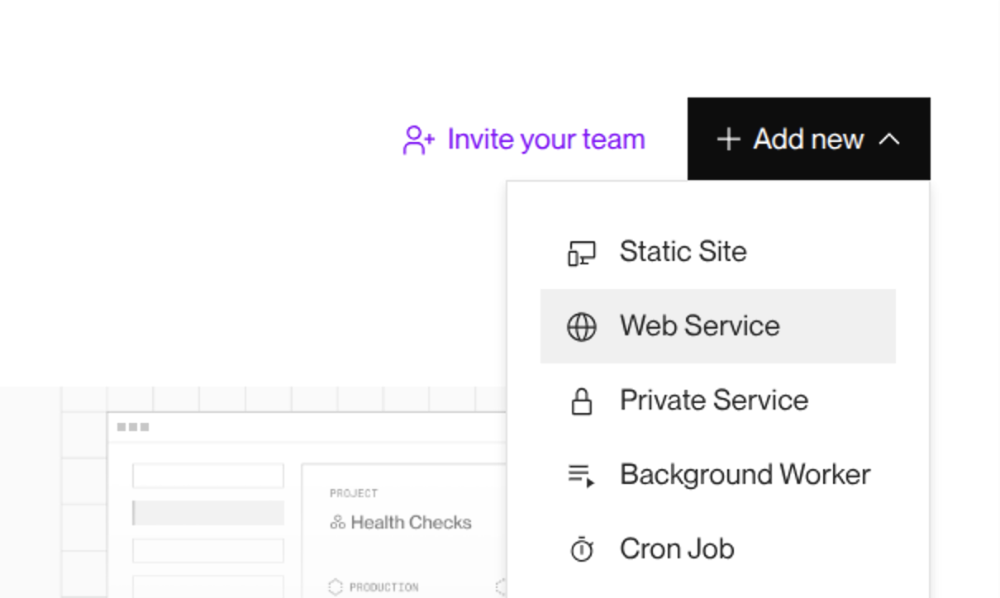
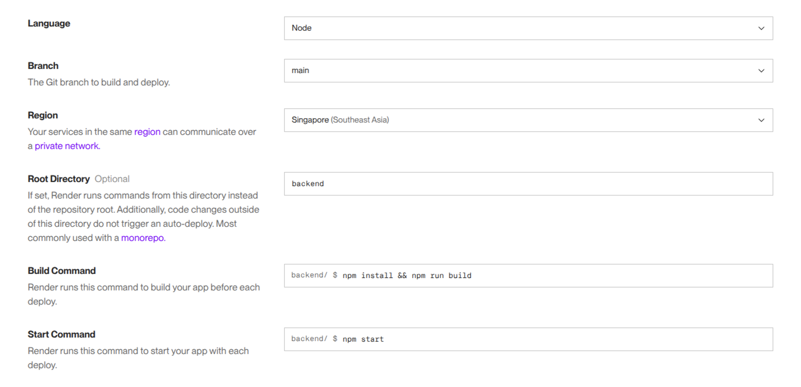
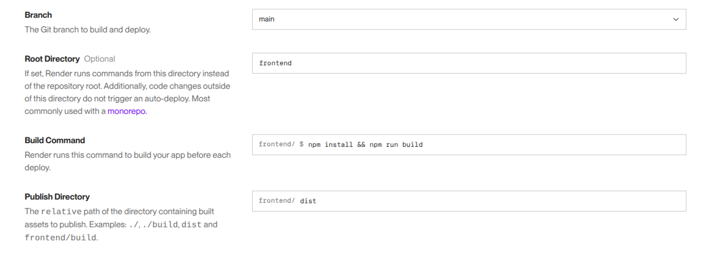
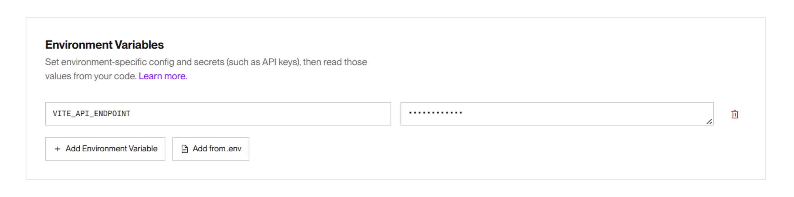
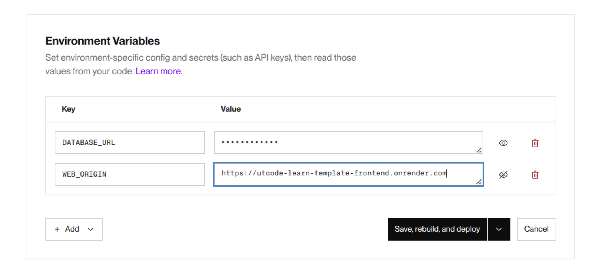

# ut.code(); Learn準拠サンプルプロジェクト

ut.code(); Learnに準拠したサンプルプロジェクトです。

## 要点

開発環境と本番環境での差異を意識する必要があります。

- フロントエンド
  - 開発環境：Viteの開発用サーバー
  - 本番環境：Viteにより出力されたHTML・CSS・JavaScriptファイル群
- バックエンド
  - 開発環境：今回は`tsx`を使用（トランスパイルをしつつ実行できる）
  - 本番環境：TypeScriptのトランスパイラ（`tsc`）により出力されたJavaScriptファイル群

## このリポジトリを作成した手順

1. 次のとおりに実行する

   ```shell
   $ npm create vite@latest

   > npx
   > create-vite

   │
   ◇  Project name:
   │  frontend
   │
   ◇  Select a framework:
   │  React
   │
   ◇  Select a variant:
   │  TypeScript
   │
   ◇  Use rolldown-vite (Experimental)?:
   │  No
   │
   ◇  Install with npm and start now?
   │  No
   │
   ◇  Scaffolding project in /home/user/projects/utcode-learn-template/frontend...
   │
   └  Done. Now run:

     cd frontend
     npm install
     npm run dev

   $ cd frontend
   $ npm install
   $ cd ..
   $ mkdir backend
   $ cd backend
   $ npm init
   $ npm install express @prisma/client dotenv cors
   $ npm install -D typescript tsx @types/express prisma @types/cors
   $ npx tsc --init
   $ npx prisma init
   ```

1. `/frontend/.env`を作成して、`VITE_API_ENDPOINT`を`http://localhost:3000`に設定する
1. `/backend/package.json`で`type`フィールドを`module`に設定する
1. `/backend/.env`で`WEB_ORIGIN`を`http://localhost:5173`に設定し、`DATABASE_URL`も設定する
1. `/backend/prisma.config.ts`に`import "dotenv/config";`を追加して、`.env`の内容が読み込まれるようにする
1. `/backend/prisma/schema.prisma`の内容をデータベースに反映させるために`npx prisma db push`を実行する
1. `/backend/tsconfig.json`の`outDir`オプションを`./dist`にしてトランスパイル結果が`/backend/dist`に入るようにする
1. `/backend/dist`を`/backend/.gitignore`に追加する
1. `/backend/package.json`を変更して次のコマンドが使えるようにする
   - `npm run dev`：`tsx`を使ってトランスパイル前のTypeScriptを直接実行する（開発環境用）
   - `npm run build`：`prisma generate`によりPrisma Clientを生成し、`tsc`によりTypeScriptをJavaScriptにトランスパイルする
   - `npm start`：`tsc`によって出力されたJavaScriptを実行する（本番環境用）

## 使い方

- Expressの起動：`cd backend && npm run dev`
- Viteの開発用サーバーの起動：`cd frontend && npm run dev`

## デプロイ手順

1. バックエンドをデプロイするため、`Web Service`を選ぶ
   
1. バックエンドは、次のように設定する
   
1. フロントエンドをデプロイするため、`Static Site`を選ぶ
   
1. フロントエンドは、次のように設定する
   
1. 環境変数`VITE_API_ENDPOINT`に先ほどデプロイしたバックエンドのURLを設定する
   
1. バックエンドの環境変数の設定を再度開き、環境変数`DATABASE_URL`を設定し、環境変数`WEB_ORIGIN`に先ほどデプロイしたフロントエンドのURLを設定する
   

## ライセンス

このリポジトリの内容は、基本的に自由にご利用いただけます。ただし、利用条件を明確にするため、以下のとおりMITライセンスを適用しています。

```plain
MIT License

Copyright (c) 2025 ut.code();

Permission is hereby granted, free of charge, to any person obtaining a copy
of this software and associated documentation files (the "Software"), to deal
in the Software without restriction, including without limitation the rights
to use, copy, modify, merge, publish, distribute, sublicense, and/or sell
copies of the Software, and to permit persons to whom the Software is
furnished to do so, subject to the following conditions:

The above copyright notice and this permission notice shall be included in all
copies or substantial portions of the Software.

THE SOFTWARE IS PROVIDED "AS IS", WITHOUT WARRANTY OF ANY KIND, EXPRESS OR
IMPLIED, INCLUDING BUT NOT LIMITED TO THE WARRANTIES OF MERCHANTABILITY,
FITNESS FOR A PARTICULAR PURPOSE AND NONINFRINGEMENT. IN NO EVENT SHALL THE
AUTHORS OR COPYRIGHT HOLDERS BE LIABLE FOR ANY CLAIM, DAMAGES OR OTHER
LIABILITY, WHETHER IN AN ACTION OF CONTRACT, TORT OR OTHERWISE, ARISING FROM,
OUT OF OR IN CONNECTION WITH THE SOFTWARE OR THE USE OR OTHER DEALINGS IN THE
SOFTWARE.
```
